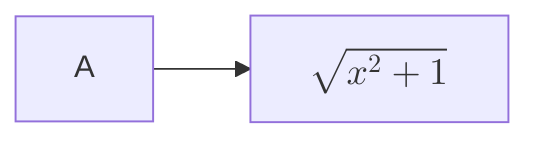

# Mathmaid

## Overview
Mathmaid introduces an enhanced Mermaid diagram plugin for Obsidian, specifically designed to support the rendering of math expressions within Mermaid diagrams. Mermaid, a popular tool integrated within Obsidian for creating diagrams and visualizations using simple text-based markup language, typically only support for KeTex, limiting its usefulness in academic and scientific notes that require complex mathematical expressions in Obsidian. This plugin addresses this gap by enabling seamless integration of math expressions within Mermaid diagrams.

## Motivation
The motivation behind developing this plugin stemmed from the recognized need within the Obsidian community for improved mathematical expression capabilities in Mermaid diagrams. Many users have expressed their difficulties and the lack of available solutions for incorporating MathJax rendering directly within their Mermaid diagrams. Despite numerous discussions in community forums and requests for this feature, there has been little to no advancement in addressing this need. This project aims to fill this void by providing a straightforward and effective solution to enhance the functionality of Mermaid diagrams in Obsidian.

## Features
- **Math Expression Support**: Enables the rendering of complex mathematical expressions within Mermaid diagrams using KeTex.
- **Seamless Integration**: Works within the existing Obsidian interface without disrupting the natural workflow, download and insert generated SVG diagrams into your notes immediately.
- **Easy to Use**: Simply write your Mermaid syntax as usual and wrap your math exprssions with `"$$ $$"` where needed; the plugin handles the rest.

## Installation
To install the plugin, follow these steps:
1. Download the latest release from the GitHub repository.
2. Extract the downloaded zip file into your Obsidian vault's plugins folder.
3. Enable the plugin from Obsidian's settings under "Community Plugins".

## Usage
Once installed, the plugin operates automatically when you create or edit Mermaid diagrams. To insert a MathJax equation into your Mermaid diagram, use the standard MathJax syntax within the text elements of your diagrams. Here is a simple example:

This code snippet will display a Mermaid diagram where the node includes a beautifully rendered MathJax equation.

## Contributing
Contributions are welcome! If you would like to contribute to the development of this plugin, please fork the repository and submit a pull request with your proposed changes. You can also open issues for any bugs you encounter or enhancements you believe would make the plugin more useful.

## License
This project is licensed under the MIT License - see the LICENSE file for details.

## Acknowledgments
- Thanks to the Obsidian community for their invaluable feedback and suggestions that have helped shape this project.
- Special thanks to the developers of Mermaid and MathJax for creating such powerful tools that serve as the foundation for this plugin.